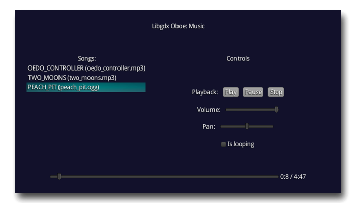

## Music

Simple music player which utilize libGDX streaming *Music* interface. This interface implemented in library by *OboeMusic*.

Three music files are used in this example:
- Cropped version of "Two Moons" by Toe;
- "Peach Pit" by Peach Pit;
- "Oedo Controller" by Yunomi.

The right to this music belong to their respective owners, this example application uses them only for educational purposes.
