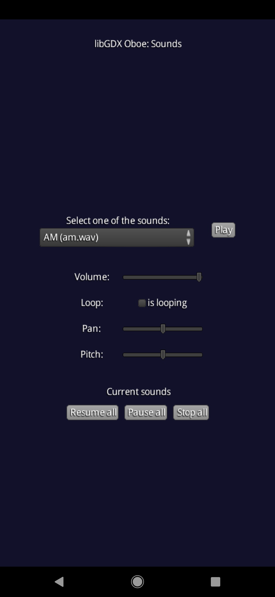

## Sounds

Soundpool manager which shows how do *OboeSounds* works in example app. You can configure any option for sound and then play it. Also, there is playback control with buttons to control the soundpool itself.

Three music files are used in this example:
- Cropped version of "Two Moons" by Toe;
- The "Am" sound (When you eat something).

The right to this music belong to their respective owners, this example application uses them only for educational purposes.
