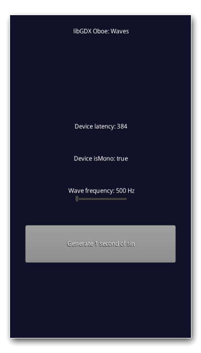

## Waves

Sine wave generator, which produces 1 second of sine wave sound. Generated pcm are fed to the instance of OboeAudioDevice. You can adjust frequency of the generator to produce different sounds.

